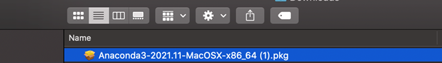

# MTA Public Metrics Website Presentation: Open Data Week 2023

## Getting started

On Thursday, March 16 from 1 PM to 2 PM, staff from MTA's Data & Analytics team will give a presentation ([register here!](https://2023.open-data.nyc/event/visualizing-mta-performance-data-with-python/)) on how you can use Python to easily analyze data from [MTA's open data program](https://new.mta.info/open-data), and visualize it on webppages similar to MTA's [public metrics website](https://metrics.mta.info/).

To help prepare for this demonstration, we've prepared a list of steps you should follow prior to the session. They walk you through downloading software needed for the session, and testing the software to make sure everything's working.

## Anaconda and Jupyter Notebook Download instructions

Python is the programming language we use to prepare data for and create [metrics.mta.info](metrics.mta.info), and what you'll use in this demonstration. Anaconda is a 'distribution' of Python. Downloading Anaconda lets you use Python, as well as other useful programs for programming in Python.

If you already have Python installed and a code-editing software set-up, you can skip to the [Installing Packages in the Terminal](#installing-packages-in-the-terminal) section.

### Step 1

Download this repository by clicking the "Code" button, and then the "Download Zip" button beneath that.

### Step 2

Extract the `open-data-week-2023` folder to somewhere in your computer by clicking or double-clicking it, and hitting the "Extract All" button.

### Step 3

Go to [this link](https://www.anaconda.com/products/distribution) and download Anaconda.

### Step 4

If you go to the Downloads folder on your computer, you should see the Anaconda installer there. It should look something like this:

Double click on that, and then you’ll be prompted through a number of steps to install Anaconda on your computer. Go through all of the steps until the installation is complete.

### Step 5

Once you finish Step 2, Anaconda will be downloaded on your computer.  The icon for the app will look like this:

Open the application.

### Step 6

Once you open Anaconda-Navigator, the interface should look similar to this:

### Step 7

Click on “Launch” under the VS Code square. VS Code is a code-editor that we'll use to edit and run our Python scripts.

It should pop up a new window like this:

### Step 8

Click on Open Folder. Then navigate to the `open-data-week-2023` file in the folder, click on the folder named , and click "select folder." 

This will set this folder as your workspace. You should be able to see what files are available in this folder on the left-hand side of your screen.

### Step 9

VSCode has extensions that make programming using Python easier. You can install extensions by clicking on the "Extensions" button on the left hand side.

You should search for and install the following extensions:

 - Python
 - Jupyter

## Installing Packages in the Terminal

Before creating a webpage, you need to have certain packages installed. Python programmers often use packages, which contain useful functions and methods for programming. What you will need to is:

### Step 1

Open a new terminal in VS Code by clicking "Terminal -> New Terminal." The terminal is a command-line interface that lets you interact directly with your computer; we'll use it to download packages and deploy the website. You should see the terminal menu at the top of your screen:

### Step 2

One of the main packages we used to make [metrics.mta.info](metrics.mta.info) is called streamlit. You can install streamlit by copying or typing `pip install streamlit` into the terminal and hitting the `Enter` key. Like so:
 

The website (and this demonstration) also uses other packages; you can install them all by copying this into the terminal, and hitting enter. On a Windows computer, you can paste into the terminal with `shift + insert`:

 `pip install pandas altair streamlit-aggrid`

### Step 3

Now to finally see if you're able to run the program:

Type `streamlit run app.py` in the terminal. As so:

Once this is completed. You should be able to see a web browser open up:

### You're Done!!

If you didn't succeed that is totally okay! We will be go over any questions you have on this during our session.

See you then! :wave:

## Troubleshooting

Here are some issues you may run into, and how you might try to address them. If these don't work, don't worry; we'll save some time at the start of the session for further troubleshooting.

### I can't download any Python packages using the terminal

If you're getting error messages when you try to install Python packages, try the following:

1) Make sure you're opening VS Code from Anaconda. Anaconda automatically activates Python in your VS Code terminal when you open it. You can tell by the `conda activate` command that automatically runs when you open VS Code, and (if you're using a command prompt) by the environment name appearing at the start of your command line.

    

2) If you're still not seeing anything, try hitting `ctrl+shift+p`, and searching for "Python: Select Interpreter." Then select a Python interpreter, and open a new terminal in VS Code.

    

3) Another option you can try is `python pip install [package names]`, or `py pip install [package names]`.

4) Sometimes on Windows computers, VS Code will activate a Windows PowerShell command-line shell rather than the Command Prompt terminal. Occasionally, PowerShell won't recognize that Python is installed while the Command Prompt will. You can change your default terminal by hitting `ctrl+shift+p`, searching for "Terminal: Select Default Profile," and selecting the Command Prompt. Then, start a new terminal 

    

### When I try to run `streamlit run app.py`, it returns an error

It may be a filepath issue. Make sure that in VS Code, you use "file --> open folder," and open the `mta-open-data-week-2023` folder, so that the folder is set as your workspace and the terminal knows where to look for the `app.py` file.
